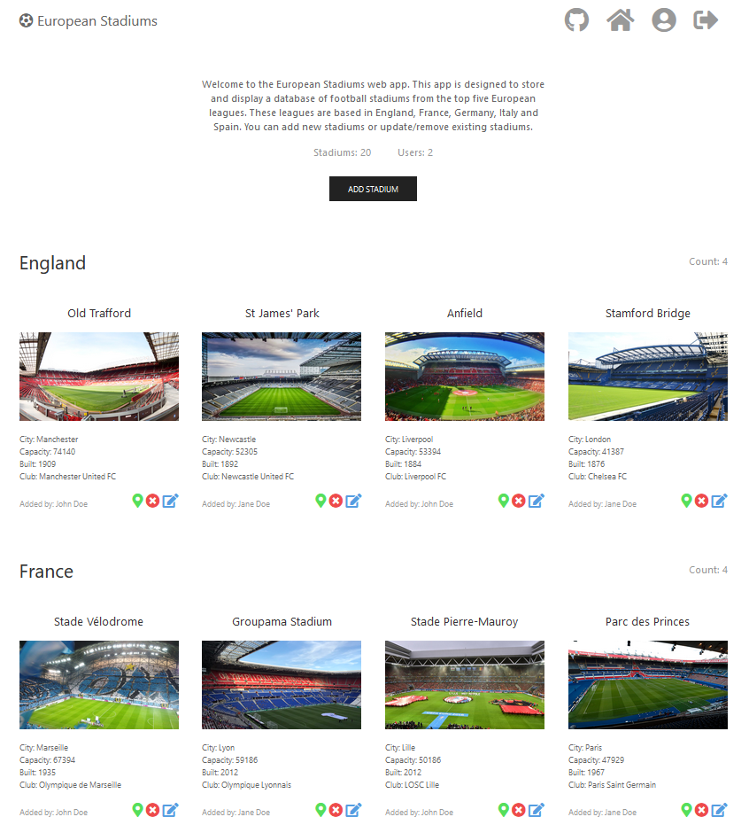

# European Stadiums

A node.js web app which stores and displays a database of football stadiums from the top five European leagues.

These leagues are based in:

- England
- France
- Germany
- Italy
- Spain

## Features

- View stadium data and images
- View stadium location on map
- Add stadiums
- Edit existing stadiums
- Remove existing stadiums
- View/write reviews on Stadiums
- Edit/delete user account

The app also features an extensive API for accessing application services.
The [Svelte version](https://github.com/TonyN96/european-stadiums-svelte) of this application incorporates use of this API.

## Technologies

- HTML, JavaScript, CSS
- Node.js, [Hapi](https://hapi.dev/)
- [UIKit](https://getuikit.com/)
- [Handlebars templating](https://handlebarsjs.com/)
- [Mongoose](https://www.npmjs.com/package/mongoose) 
- [mais-mongoose-seeder](https://www.npmjs.com/package/mais-mongoose-seeder)
- [Cloudinary](https://cloudinary.com/)
- [MongoDB Atlas](https://www.mongodb.com/cloud/atlas)
- [Leaflet.js](https://leafletjs.com/)
- [JsonWebToken](https://github.com/auth0/node-jsonwebtoken)

## Usage

```
# Clone the repository:
$ git clone https://github.com/TonyN96/european-stadiums.git

# Go into the repository
$ cd european-stadiums

# Install dependencies
$ npm install
```

Insert your environment variables in `.env_sample`.
Rename `.env_sample` to `.env`

```
# Run the app
$ npm start
```

